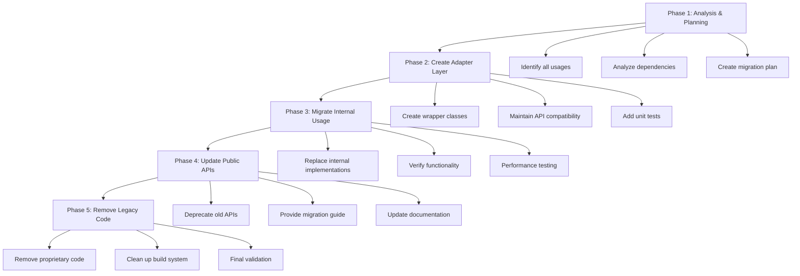

# ADR 001: Modernize TargetRTS Data Structures with C++ Standard Library

## Status

Proposed

## Context

The TargetRTS codebase currently uses proprietary data structure implementations that were developed before modern C++ standards became widely available. These custom implementations include:

- **RTDictionary**: A custom hash map implementation using key-value associations
- **RTMessageQ**: A custom message queue with head/tail pointers
- **RTQueue**: A custom queue implementation
- **RTElasticArray**: A dynamic array implementation
- **RTArray_class**: Array type descriptor and management

The codebase was originally developed when C++ Standard Library support was limited or unavailable on target platforms. However, with the adoption of C++11 as the minimum language standard, we now have access to mature, well-tested, and optimized standard library containers.

### Current State

- TargetRTS contains ~120+ RT-prefixed classes across the codebase
- Custom data structures are used throughout the runtime system
- Implementation is spread across multiple source directories (src/RTDictionary, src/RTMessageQ, etc.)
- Each custom container requires maintenance, testing, and documentation
- Developers must learn proprietary APIs instead of standard C++ idioms

### Drivers for Change

This modernization initiative is driven by multiple factors:

1. **Code Maintainability**: Reduce custom code that needs to be maintained, tested, and debugged
2. **Standard Library Optimizations**: Leverage highly optimized implementations from compiler vendors
3. **Reduced Learning Curve**: New developers are familiar with standard library containers
4. **Better Tooling Support**: IDEs, static analyzers, and debugging tools have excellent support for standard containers
5. **Improved Portability**: Standard library is available on all C++11-compliant platforms
6. **Modern C++ Best Practices**: Align with contemporary C++ development standards
7. **Technical Debt Reduction**: Address legacy code patterns from pre-C++11 era
8. **Future-Proofing**: Prepare codebase for future C++ standard upgrades (C++14, C++17, etc.)

## Decision

We will modernize the TargetRTS codebase by replacing proprietary data structure implementations with equivalent C++ Standard Library containers from C++11, following a phased migration approach.

### Proposed Mappings

| Proprietary Type | C++ Standard Library Equivalent | Rationale |
|-----------------|--------------------------------|-----------|
| `RTDictionary` | `std::unordered_map<std::string, void*>` | Hash-based key-value storage with O(1) average lookup |
| `RTMessageQ` | `std::deque<RTMessage*>` | Double-ended queue with efficient head/tail operations |
| `RTQueue` | `std::queue<T>` or `std::deque<T>` | FIFO queue operations |
| `RTElasticArray` | `std::vector<T>` | Dynamic array with automatic growth |
| `RTArray_class` | `std::array<T, N>` or `std::vector<T>` | Fixed or dynamic array depending on use case |

### Migration Strategy

The migration will follow a **phased, incremental approach**:

### Implementation Phases

#### Phase 1: Analysis & Planning (Current Phase)
- Document all proprietary data structures
- Identify all usage locations in codebase
- Analyze dependencies and impact
- Create detailed migration plan for each structure
- Establish success criteria and testing strategy

#### Phase 2: Create Adapter Layer
- Implement wrapper classes that maintain existing API
- Use standard library internally
- Ensure binary compatibility where required
- Create comprehensive unit tests
- Benchmark performance against original implementations

#### Phase 3: Migrate Internal Usage
- Replace internal implementations with standard library
- Update internal code to use new implementations
- Maintain external API compatibility
- Continuous integration testing
- Performance validation

#### Phase 4: Update Public APIs
- Deprecate old APIs with clear warnings
- Provide migration documentation
- Offer transition period for users
- Update all examples and documentation
- Support both old and new APIs temporarily

#### Phase 5: Remove Legacy Code
- Remove deprecated proprietary implementations
- Clean up build system and dependencies
- Final performance and compatibility validation
- Update all documentation
- Release notes and migration guide

## Consequences

### Positive Consequences

1. **Reduced Maintenance Burden**: Less custom code to maintain, test, and debug
2. **Improved Performance**: Benefit from compiler vendor optimizations
3. **Better Developer Experience**: Familiar APIs reduce learning curve
4. **Enhanced Tooling**: Better IDE support, debugging, and static analysis
5. **Increased Portability**: Standard library available on all target platforms
6. **Modern Codebase**: Aligns with contemporary C++ practices
7. **Future-Ready**: Easier to adopt newer C++ standards
8. **Community Support**: Extensive documentation and community knowledge

### Negative Consequences

1. **Migration Effort**: Significant development time required
2. **Testing Overhead**: Extensive testing needed to ensure compatibility
3. **Temporary Code Duplication**: Both old and new implementations during transition
4. **Learning Curve**: Team needs to understand standard library nuances
5. **Potential Performance Variations**: May need tuning for specific use cases
6. **Binary Compatibility**: May break ABI in some cases

### Risks and Mitigations

| Risk | Impact | Mitigation Strategy |
|------|--------|-------------------|
| Performance regression | High | Comprehensive benchmarking before/after; optimize hot paths |
| Breaking changes | High | Maintain adapter layer; phased migration; extensive testing |
| Embedded platform limitations | Medium | Verify C++11 support on all targets; provide fallbacks if needed |
| Memory overhead | Medium | Profile memory usage; optimize container choices per use case |
| Thread safety issues | High | Careful review of concurrent access patterns; add synchronization where needed |
| Compilation time increase | Low | Monitor build times; use forward declarations; optimize includes |

### Constraints and Considerations

1. **Backward Compatibility**: Must maintain API compatibility during transition period
2. **Performance Requirements**: New implementations must meet or exceed current performance
3. **Embedded Systems**: Must work on resource-constrained platforms with limited C++11 support
4. **Compiler Support**: Must support minimum compiler versions (GCC 4.x, Clang 14.x, MSVC 17.0)
5. **Memory Constraints**: Standard library containers may have different memory characteristics
6. **Thread Safety**: Must preserve existing thread safety guarantees
7. **Exception Safety**: Standard library uses exceptions; must handle in exception-free environments

### Success Criteria

- All proprietary data structures successfully replaced
- No performance regression (within 5% tolerance)
- All existing tests pass
- Binary compatibility maintained where required
- Documentation updated
- Migration guide provided for users
- Code coverage maintained or improved
- Build times not significantly increased

## Alternatives Considered

### Alternative 1: Keep Proprietary Implementations
**Rejected**: Continues technical debt and maintenance burden. Misses opportunity to modernize.

### Alternative 2: Use Third-Party Libraries (e.g., Boost)
**Rejected**: Adds external dependency; standard library is more portable and universally available.

### Alternative 3: Hybrid Approach (Mix of Both)
**Rejected**: Increases complexity; developers must learn both APIs; harder to maintain.

### Alternative 4: Complete Rewrite
**Rejected**: Too risky; would require extensive testing; disrupts ongoing development.

## References

- [C++11 Standard Library Containers](https://en.cppreference.com/w/cpp/container)
- [TargetRTS Source Code](c:/git/rsarte-target-rts/rsa_rt/C++/TargetRTS)
- [C++ Core Guidelines](https://isocpp.github.io/CppCoreGuidelines/CppCoreGuidelines)
- [Effective Modern C++ by Scott Meyers](https://www.oreilly.com/library/view/effective-modern-c/9781491908419/)

## Related Decisions

- Future ADR: Migration to C++14/17 features
- Future ADR: Smart pointer adoption (std::unique_ptr, std::shared_ptr)
- Future ADR: Modern concurrency primitives (std::thread, std::mutex, std::atomic)

## Notes

- This ADR focuses specifically on data structure modernization
- Other modernization efforts (smart pointers, concurrency, etc.) will be addressed in separate ADRs
- The phased approach allows for continuous delivery and risk mitigation
- Performance benchmarking is critical at each phase
- Community feedback during transition period is essential

---

**Date**: 2026-05-02  
**Author**: TargetRTS Development Team  
**Reviewers**: [To be assigned]  
**Last Updated**: 2026-05-02