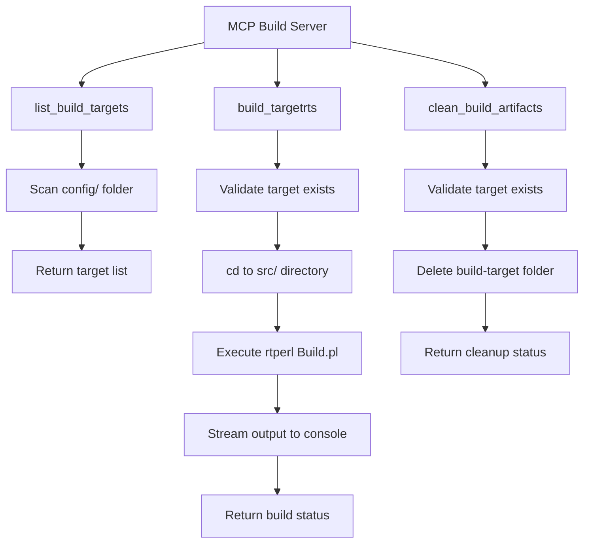

# MCP Build Server for TargetRTS - Implementation Plan

## Overview

Create a TypeScript-based MCP (Model Context Protocol) server that provides tools for building the TargetRTS library from source code. The server will enable automated builds through a standardized interface, with real-time output streaming and comprehensive error handling.

## Project Location

- **MCP Server Directory**: `c:/bob/git/BobCppModernization/mcp-build-server/`
- **TargetRTS Root**: `c:/git/rsarte-target-rts/rsa_rt/C++/TargetRTS`
- **Build Script Location**: `c:/git/rsarte-target-rts/rsa_rt/C++/TargetRTS/src/Build.pl`
- **Config Directory**: `c:/git/rsarte-target-rts/rsa_rt/C++/TargetRTS/config/`

## Architecture



## MCP Tools

### 1. `list_build_targets`

**Purpose**: List all available target configurations for building TargetRTS.

**Parameters**: None

**Behavior**:
- Scans the `config/` directory in TargetRTS root
- Returns array of subdirectory names (each represents a valid target configuration)
- Filters out non-directory entries

**Return Format**:
```json
{
  "content": [
    {
      "type": "text",
      "text": "Available build targets:\n- WinT.x64-MinGw-12.2.0\n- LinuxT.x64-gcc-12.x\n- MacT.AArch64-Clang-15.x\n..."
    }
  ]
}
```

**Error Handling**:
- Config directory not found
- Permission errors reading directory

### 2. `build_targetrts`

**Purpose**: Build the TargetRTS library for a specified target configuration.

**Parameters**:
- `target` (required, string): Target configuration name (must match a folder in `config/`)
- `build_command` (optional, string): Build command to pass to Build.pl (default: "make all")

**Behavior**:
1. Validate that target exists in `config/` directory
2. Change working directory to `src/`
3. Execute: `rtperl Build.pl <target> <build_command>`
4. Stream stdout and stderr to console in real-time
5. Capture exit code and return build status

**Command Example**:
```bash
cd c:/git/rsarte-target-rts/rsa_rt/C++/TargetRTS/src
rtperl Build.pl WinT.x64-MinGw-12.2.0 make all
```

**Return Format**:
```json
{
  "content": [
    {
      "type": "text",
      "text": "Build completed successfully for target: WinT.x64-MinGw-12.2.0\nExit code: 0"
    }
  ]
}
```

**Error Handling**:
- Target configuration not found
- rtperl command not found in PATH
- Build.pl not found
- Build failures (non-zero exit code)
- Permission errors

### 3. `clean_build_artifacts`

**Purpose**: Clean build artifacts for a specified target configuration.

**Parameters**:
- `target` (required, string): Target configuration name

**Behavior**:
1. Validate that target exists in `config/` directory
2. Construct path to build artifacts: `build-<target>`
3. Delete the entire `build-<target>` directory if it exists
4. Report success or if directory didn't exist

**Directory to Delete**:
```
c:/git/rsarte-target-rts/rsa_rt/C++/TargetRTS/build-<target>/
```

**Return Format**:
```json
{
  "content": [
    {
      "type": "text",
      "text": "Successfully cleaned build artifacts for target: WinT.x64-MinGw-12.2.0\nDeleted: build-WinT.x64-MinGw-12.2.0/"
    }
  ]
}
```

**Error Handling**:
- Target configuration not found
- Build directory doesn't exist (not an error, just report)
- Permission errors deleting directory
- Directory in use by another process

## File Structure

```
mcp-build-server/
├── package.json              # Node.js project configuration
├── tsconfig.json            # TypeScript compiler configuration
├── README.md                # Usage documentation
├── src/
│   ├── index.ts            # Main MCP server entry point
│   ├── config-scanner.ts   # Target configuration scanner
│   ├── build-executor.ts   # Build command executor
│   └── clean-executor.ts   # Build artifact cleaner
└── build/                   # Compiled JavaScript output (generated)
    └── index.js            # Compiled server entry point
```

## Implementation Details

### Output Streaming Strategy

Since the MCP server runs in a Node.js process started from a VS Code terminal:

1. **Build Output**: Use `console.error()` to write build output to stderr, making it visible in the terminal
2. **Process Spawning**: Use `child_process.spawn()` with stdio configuration:
   ```typescript
   spawn('rtperl', ['Build.pl', target, buildCommand], {
     cwd: srcDir,
     stdio: ['ignore', 'inherit', 'inherit'], // inherit stdout and stderr
     shell: true
   });
   ```
3. **Real-time Streaming**: The `inherit` option ensures output appears immediately in the terminal
4. **Status Reporting**: Return structured JSON with build status and summary

### Target Configuration Validation

```typescript
function validateTarget(target: string): boolean {
  const configDir = path.join(TARGETRTS_ROOT, 'config');
  const targetPath = path.join(configDir, target);
  return fs.existsSync(targetPath) && fs.statSync(targetPath).isDirectory();
}
```

### Error Handling Strategy

1. **Validation Errors**: Return structured error response with `isError: true`
2. **Execution Errors**: Catch exceptions and return detailed error messages
3. **Build Failures**: Report non-zero exit codes with context
4. **Path Errors**: Validate all paths before operations

### Environment Configuration

The TargetRTS root path will be provided via environment variable:

```typescript
const TARGETRTS_ROOT = process.env.TARGETRTS_ROOT || 'c:/git/rsarte-target-rts/rsa_rt/C++/TargetRTS';
```

This allows flexibility if the TargetRTS location changes.

## Dependencies

### Required npm Packages

```json
{
  "dependencies": {
    "@modelcontextprotocol/sdk": "^1.0.0",
    "zod": "^3.22.0"
  },
  "devDependencies": {
    "@types/node": "^20.0.0",
    "typescript": "^5.3.0"
  }
}
```

### Node.js Built-in Modules

- `fs` / `fs/promises` - File system operations
- `path` - Path manipulation
- `child_process` - Process spawning for rtperl

## Configuration Files

### package.json

```json
{
  "name": "mcp-targetrts-build-server",
  "version": "1.0.0",
  "description": "MCP server for building TargetRTS library",
  "type": "module",
  "main": "build/index.js",
  "bin": {
    "mcp-targetrts-build": "build/index.js"
  },
  "scripts": {
    "build": "tsc && node -e \"require('fs').chmodSync('build/index.js', '755')\"",
    "watch": "tsc --watch",
    "start": "node build/index.js"
  },
  "keywords": ["mcp", "targetrts", "build", "compiler"],
  "author": "",
  "license": "MIT"
}
```

### tsconfig.json

```json
{
  "compilerOptions": {
    "target": "ES2022",
    "module": "Node16",
    "moduleResolution": "Node16",
    "outDir": "./build",
    "rootDir": "./src",
    "strict": true,
    "esModuleInterop": true,
    "skipLibCheck": true,
    "forceConsistentCasingInFileNames": true,
    "resolveJsonModule": true,
    "declaration": true,
    "declarationMap": true,
    "sourceMap": true
  },
  "include": ["src/**/*"],
  "exclude": ["node_modules", "build"]
}
```

## MCP Settings Configuration

The server will be added to Bob's MCP settings file at:
`C:\Users\MATTIAS.MOHLIN\.bob\settings\mcp_settings.json`

```json
{
  "mcpServers": {
    "targetrts-build": {
      "command": "node",
      "args": [
        "c:/bob/git/BobCppModernization/mcp-build-server/build/index.js"
      ],
      "env": {
        "TARGETRTS_ROOT": "c:/git/rsarte-target-rts/rsa_rt/C++/TargetRTS"
      },
      "disabled": false,
      "alwaysAllow": [],
      "disabledTools": []
    }
  }
}
```

## Usage Examples

After installation and configuration, the MCP server provides these capabilities:

### Example 1: List Available Targets

**User Command**: "What TargetRTS build targets are available?"

**Tool Invocation**: `list_build_targets()`

**Expected Output**:
```
Available build targets:
- WinT.x64-MinGw-12.2.0
- WinT.x64-Clang-16.x
- LinuxT.x64-gcc-12.x
- MacT.AArch64-Clang-15.x
- VxWorks7T.simnt-Clang-15.x
```

### Example 2: Build TargetRTS

**User Command**: "Build TargetRTS for Windows MinGW"

**Tool Invocation**: `build_targetrts({ target: "WinT.x64-MinGw-12.2.0" })`

**Console Output** (streamed in real-time):
```
Compiling RTAbortController/ct.cc...
Compiling RTActor/ct.cc...
Compiling RTActorFactory/ct.cc...
...
Linking libTargetRTS.a...
Build complete.
```

**Tool Response**:
```
Build completed successfully for target: WinT.x64-MinGw-12.2.0
Exit code: 0
```

### Example 3: Clean Build Artifacts

**User Command**: "Clean the build artifacts for Linux GCC"

**Tool Invocation**: `clean_build_artifacts({ target: "LinuxT.x64-gcc-12.x" })`

**Tool Response**:
```
Successfully cleaned build artifacts for target: LinuxT.x64-gcc-12.x
Deleted: build-LinuxT.x64-gcc-12.x/
```

### Example 4: Clean and Rebuild

**User Command**: "Clean and rebuild TargetRTS for Windows MinGW"

**Tool Invocations**:
1. `clean_build_artifacts({ target: "WinT.x64-MinGw-12.2.0" })`
2. `build_targetrts({ target: "WinT.x64-MinGw-12.2.0" })`

## Testing Strategy

### Manual Testing Steps

1. **Test Target Listing**:
   ```
   Ask: "List available TargetRTS build targets"
   Verify: Returns list of config subdirectories
   ```

2. **Test Valid Build**:
   ```
   Ask: "Build TargetRTS for WinT.x64-MinGw-12.2.0"
   Verify: Build executes, output streams to console, returns success
   ```

3. **Test Invalid Target**:
   ```
   Ask: "Build TargetRTS for InvalidTarget"
   Verify: Returns error message about target not found
   ```

4. **Test Clean Operation**:
   ```
   Ask: "Clean build artifacts for WinT.x64-MinGw-12.2.0"
   Verify: build-WinT.x64-MinGw-12.2.0 directory is deleted
   ```

5. **Test Clean Non-existent**:
   ```
   Ask: "Clean build artifacts for WinT.x64-MinGw-12.2.0" (when already clean)
   Verify: Reports directory doesn't exist (not an error)
   ```

### Error Scenarios to Test

- TargetRTS root directory doesn't exist
- Config directory doesn't exist
- rtperl not in PATH
- Build.pl not found
- Build fails with compiler errors
- Permission denied on build directory
- Invalid target configuration name

## Common Issues and Solutions

### Issue: "rtperl command not found"

**Cause**: rtperl is not in the system PATH

**Solution**: Ensure rtperl is installed and added to PATH, or provide full path to rtperl in the build executor

### Issue: Build output not visible

**Cause**: stdio not properly configured for streaming

**Solution**: Use `stdio: ['ignore', 'inherit', 'inherit']` in spawn options

### Issue: Permission denied deleting build directory

**Cause**: Files in use or insufficient permissions

**Solution**: 
- Close any programs using files in the build directory
- Run with appropriate permissions
- Provide clear error message to user

### Issue: Target configuration not found

**Cause**: Typo in target name or config directory structure changed

**Solution**: Use `list_build_targets` to see available targets, ensure exact match (case-sensitive)

## Future Enhancements

Potential improvements for future versions:

1. **Parallel Builds**: Support building multiple targets simultaneously
2. **Build Progress**: Parse build output to show progress percentage
3. **Build History**: Track build times and success rates
4. **Incremental Builds**: Support for incremental compilation
5. **Build Profiles**: Save common build configurations
6. **Notification Support**: Alert when long builds complete
7. **Build Logs**: Save detailed build logs to files
8. **Dependency Checking**: Verify build tool versions before building

## Implementation Checklist

- [ ] Create project structure in `mcp-build-server/`
- [ ] Implement `config-scanner.ts` for target discovery
- [ ] Implement `build-executor.ts` for build execution
- [ ] Implement `clean-executor.ts` for artifact cleanup
- [ ] Create main `index.ts` with MCP server setup
- [ ] Define all three tools with proper schemas
- [ ] Add comprehensive error handling
- [ ] Configure stdio streaming for real-time output
- [ ] Create `package.json` with dependencies
- [ ] Create `tsconfig.json` for TypeScript compilation
- [ ] Build and test the server locally
- [ ] Add server to Bob MCP settings
- [ ] Test all three tools with various scenarios
- [ ] Create `README.md` with usage documentation
- [ ] Verify error handling for edge cases

## Success Criteria

The MCP Build Server implementation will be considered successful when:

1. ✅ All three tools are functional and accessible through Bob
2. ✅ Target configurations are correctly discovered from config directory
3. ✅ Builds execute successfully with real-time output streaming
4. ✅ Build artifacts can be cleaned reliably
5. ✅ Error messages are clear and actionable
6. ✅ The server handles edge cases gracefully
7. ✅ Documentation is complete and accurate
8. ✅ The server can be easily configured for different TargetRTS locations

## Conclusion

This MCP Build Server will provide a robust, user-friendly interface for building the TargetRTS library. By leveraging the MCP protocol, it integrates seamlessly with Bob, enabling natural language commands for complex build operations while maintaining full visibility of the build process through real-time output streaming.