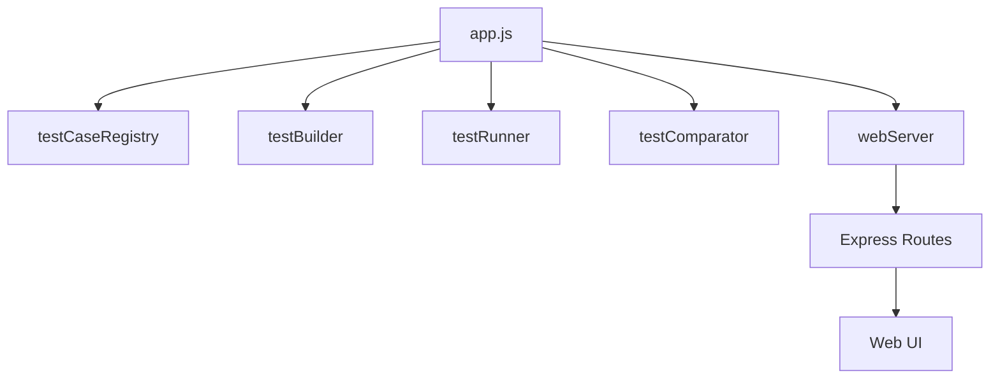
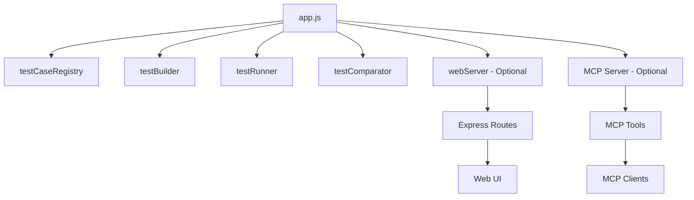

# MCP Server Integration Plan

## Overview
This plan outlines the integration of a Model Context Protocol (MCP) server into the existing test runner application. The MCP server will provide programmatic access to test execution functionality without requiring the web UI.

## Architecture

### Current Architecture


### Proposed Architecture


## Implementation Details

### 1. Dependencies
Add the MCP SDK to [`package.json`](package.json):
```json
"@modelcontextprotocol/sdk": "^1.0.0"
```

### 2. Command-Line Argument
Add `--mcp` option to [`argv.js`](argv.js:30-125) to enable MCP server mode:
- When provided, the MCP server will start using stdio transport
- Can be used independently or alongside `--port` for web server
- MCP server will communicate via stdin/stdout

### 3. MCP Server Implementation
Create MCP server in [`app.js`](app.js) that:
- Initializes when `--mcp` argument is present
- Uses stdio transport for communication
- Registers 5 core tools (see below)
- Shares access to existing test infrastructure

### 4. MCP Tools

#### Tool 1: `get_test_data`
**Purpose**: Retrieve information about all registered test cases
**Input Schema**: None
**Output**: JSON object containing:
- `testSuite`: Name of the test suite
- `testCases`: Array of test case objects with properties:
  - `name`: Test case name
  - `state`: Current state (Pending/Started/Completed)
  - `verdict`: Pass/fail status
  - `errorType`: Error type if failed
  - `steps`: Array of test steps

**Implementation**: Calls [`testCaseRegistry.getTestCases()`](testCaseRegistry.js:1-50) and formats response

#### Tool 2: `run_all_tests`
**Purpose**: Execute all registered test cases
**Input Schema**: None
**Output**: Status message indicating test execution started
**Side Effects**: 
- Triggers [`buildAndRunAllTests()`](app.js:143-162)
- Updates test case states asynchronously
- Clients must poll `get_test_data` for results

**Implementation**: Similar to [`/runAllTests`](app.js:187-206) Express route

#### Tool 3: `run_test`
**Purpose**: Execute a specific test case
**Input Schema**:
```json
{
  "testCase": "string (required) - Name of test case to run"
}
```
**Output**: Success/error message
**Validation**:
- Test case must exist
- Test case must not be currently running

**Implementation**: Similar to [`/runTest`](app.js:209-231) Express route

#### Tool 4: `get_build_log`
**Purpose**: Retrieve build log for a specific test case
**Input Schema**:
```json
{
  "testCase": "string (required) - Name of test case"
}
```
**Output**: Plain text build log content
**Validation**: Test case must exist

**Implementation**: Similar to [`/buildLog`](app.js:271-285) Express route

#### Tool 5: `get_test_log`
**Purpose**: Retrieve test execution log for a specific test case
**Input Schema**:
```json
{
  "testCase": "string (required) - Name of test case",
  "stream": "string (required) - Either 'stdout' or 'stderr'"
}
```
**Output**: Plain text log content
**Validation**: 
- Test case must exist
- Stream must be 'stdout' or 'stderr'

**Implementation**: Similar to [`/testLog`](app.js:288-309) Express route

## Integration Strategy

### Phase 1: Setup
1. Add MCP SDK dependency
2. Add `--mcp` command-line argument
3. Create basic MCP server structure

### Phase 2: Core Tools
1. Implement `get_test_data` tool
2. Implement `run_all_tests` tool
3. Implement `run_test` tool

### Phase 3: Log Tools
1. Implement `get_build_log` tool
2. Implement `get_test_log` tool

### Phase 4: Documentation & Testing
1. Update README with MCP usage
2. Test MCP server independently
3. Test MCP server with web server running simultaneously

## Usage Examples

### Starting MCP Server Only
```bash
node app.js --testDir=../tests --targetConfig=WinT.x64-MinGw-12.2.0 --mcp
```

### Starting Both Web Server and MCP Server
```bash
node app.js --testDir=../tests --targetConfig=WinT.x64-MinGw-12.2.0 --port=4444 --mcp
```

### MCP Client Configuration
Add to MCP client settings (e.g., Cline):
```json
{
  "mcpServers": {
    "test-runner": {
      "command": "node",
      "args": [
        "c:/git/rtistic-pub-doc/art-comp-test/runner/app.js",
        "--testDir=../tests",
        "--targetConfig=WinT.x64-MinGw-12.2.0",
        "--javaVM=C:/openjdk/jdk-21.0.4.7-hotspot/bin/java",
        "--artCompilerJar=C:/VSCode/data/extensions/secure-dev-ops.code-realtime-ce-2.0.8/bin/artcompiler.jar",
        "--targetRTSDir=C:/VSCode/data/extensions/secure-dev-ops.code-realtime-ce-2.0.8/TargetRTS",
        "--mcp"
      ]
    }
  }
}
```

## Key Design Decisions

1. **Stdio Transport**: Using stdio for MCP communication allows the server to run as a subprocess of MCP clients
2. **Shared Infrastructure**: MCP tools reuse existing test execution logic from Express routes
3. **Optional Activation**: MCP server only starts when `--mcp` is provided, maintaining backward compatibility
4. **Asynchronous Execution**: Test execution is async; clients poll for results using `get_test_data`
5. **No Termination Control**: Unlike web server, MCP server doesn't expose termination endpoint (handled by client)

## Benefits

1. **Programmatic Access**: Run tests without opening web browser
2. **IDE Integration**: Use tests directly from development tools
3. **Automation**: Easier integration with CI/CD pipelines via MCP clients
4. **Flexibility**: Can run MCP server alone or alongside web server
5. **Consistency**: Same test execution logic as web interface

## Considerations

1. **Concurrency**: Both web server and MCP server can trigger tests simultaneously - existing code handles this
2. **State Management**: Test state is shared between web and MCP interfaces
3. **Error Handling**: MCP tools must validate inputs and return clear error messages
4. **Performance**: MCP server adds minimal overhead as it reuses existing infrastructure